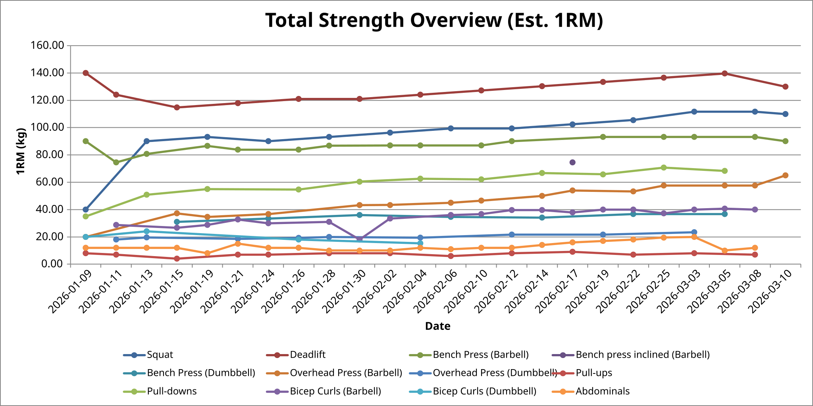
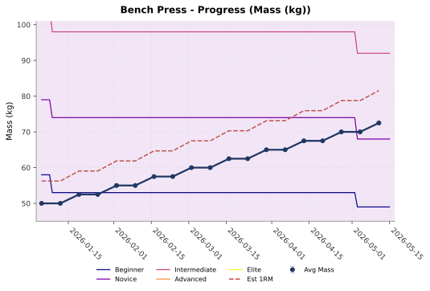
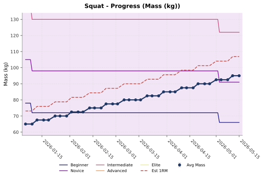
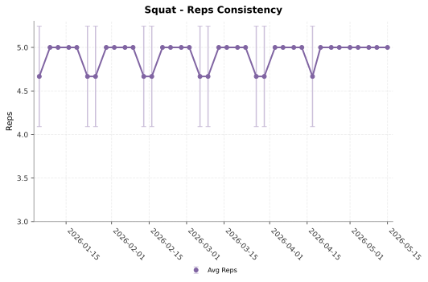
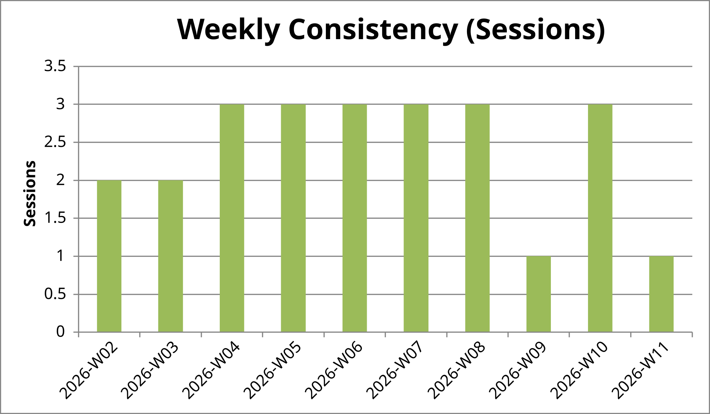
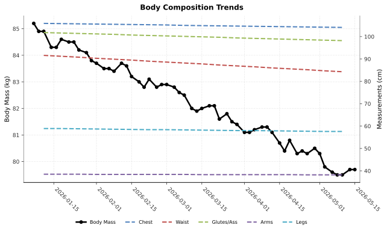
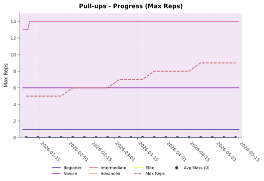
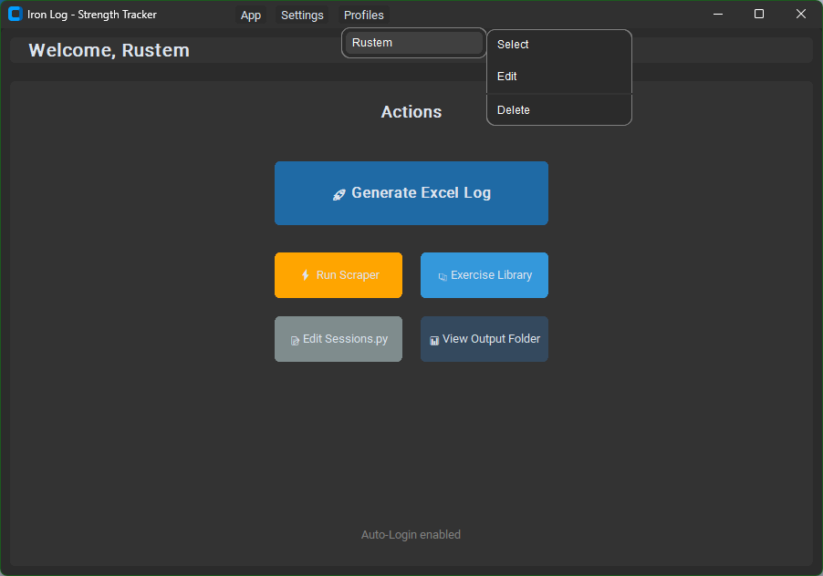

# Iron Log

Iron Log is a local, Python-based training tracking tool. It operates without subscriptions or cloud dependencies. The tool converts manual workout entries (sets, reps, and mass) from a Python dictionary into a formatted Excel workbook with dynamic charts. Strength standards are overlaid onto the charts and adjust automatically based on logged body mass.

## Visual Tour

### Strength & Progress Tracking

Charts track your estimated maximum strength and actual mass used. The next benchmark tier (e.g., Novice, Intermediate) is displayed as a target line to keep you focused on the next goal. Backgrounds utilize a Plasma color palette to indicate permanent milestone achievements via 90-degree vertical wall transitions.



*Example: A birds-eye view of all major lifts tracked against Est. 1RM.*



*Example: Tracking Bench Press PRs with shifting standard benchmarks.*



*Example: Seeing the next target line on Squat progression.*

### Reps & Consistency

Focus extends beyond the heaviest mass. Average reps and rep evolution are tracked to monitor efficiency and volume. Standard deviation error bars indicate set variance. A consistency chart logs weekly training frequency.



*Tracking rep efficiency and volume over time.*



*A bar chart tracking weekly training frequency.*

### Body Composition & Body-Mass Exercises

Additional metrics are tracked alongside body mass. Measurements such as waist and biceps are supported. The tool also handles body-mass exercises (like pull-ups) by tracking reps instead of mass.



*Correlating body mass changes with physical measurements.*



*Example: Tracking progress on exercises where reps are the primary metric.*

## Features

- **Adaptive Strength Benchmarks**: Benchmark lines (`Beginner` to `Elite`) are not static. They dynamically recalculate for every session based on your **Sex** (configured in your profile) and your **logged Body Mass** for that specific date. This ensures your progress is always measured with absolute pound-for-pound precision.
- **Retroactive Milestone Backgrounds**: The chart background fills with the highest strength tier you have *ever* achieved — retroactively across the full date range. Once you hit Novice, the whole chart goes purple. Even for exercises with one session on record, the background is correct from day one.
- **Persistent Feature Toggles**: Control your chart's complexity directly from the **Settings** menu. You can independently toggle **PRs** (Est 1RM lines), **Standards** (Benchmark lines), and **Milestones** (Colored background areas). These choices are remembered per-user.
- **Time-Scaled Charts**: The X-axis utilizes standard date scaling with -45 degree rotated labels for maximum compactness. Training gaps are visually represented, while every calendar date is processed to ensure smooth, continuous background blocks. Standard lines span across gaps — no floating dots for infrequent exercises.
- **Auto-Zoom Scaling**: Y-axis scaling automatically clamps to include your **estimated 1RM (PR line)** with a 15% margin. If the next target standard tier is above your current best, the axis extends to show it — so you always see what you're reaching for.
- **Intelligent Cycle Planning**: Iron Log natively tracks your training split via `day` metadata (e.g., `day: 1`, `day: "PR"`). The built-in "Plan Next Cycle" utility automatically detects what cycle you are on, pre-fills the next block of days based on your recent history, and provides an interactive UI with [+2.5 kg] and [+2 Reps] quick-action buttons to cleanly adjust progressions before writing them to your log.
- **Dynamic Data Structures**: Fully supports non-uniform sets/reps (e.g., `[10, 8, 6]`) instead of forcing flattened integer logic, allowing authentic records of drop sets or failure sets directly in the user log.
- **Data Integrity Check**: Before generating any report, Iron Log verifies that every session entry has the same number of reps and masses. If something doesn't match, it tells you exactly which date and exercise needs fixing — and refuses to generate a broken report.
- **Multi-User Profiles**: Each user has their own profile with a configured data directory, sex, and chart preferences. Auto-login support remembers your last used profile. Profile mismatch warnings fire if your `sessions.py` owner doesn't match the active profile.

## Recent Overhaul: Milestone backgrounds and aesthetic overhaul

- **90-degree vertical wall** background transitions for milestones.
- **Infinite height fill** via 1,000,000 baseline scaling.
- **Retroactive achievement tracking**: background fills from the start of the chart regardless of when the milestone was hit.
- **Plasma color palette** applied to milestone visualizations.
- **95% customizable transparency** for chart backgrounds.
- **Condensed standard level legend naming** (Beg, Nov, Int, Adv, Eli).
- **800x450 individual chart resolution** for crystalline clarity.
- **Auto-zoom Y-axis scaling** with 15% margin based on 1RM, extended to show the next unreached standard tier.
- **X-axis date labels** rotated to -45 degrees.
- **Standard deviation error bars** restored to mass and rep charts.
- **Circle markers** on the primary Avg Mass and Avg Reps lines — all benchmarks and overlays stay clean without markers.
- **Standard lines span gaps** — sparse exercises (few sessions) no longer show floating data points.
- **Personal Records worksheet** with dynamic strength level coloring.
- **User Profile worksheet** for biographic data context.
- **Gap-less rendering**: All calendar dates parsed for continuous background visualization.
- **Centralized styling variables** in the class constructor for easy tweaking.
- **Surgical initialization order** for worksheet and chart creation.

## Workbook Overview

- **Progress_Charts**: The visual heart of the log. Interactive visualizations showing your performance trends layered against your personal achievements.
- **Data_Log**: A comprehensive chronological history of every workout, featuring daily volume, relative intensity, and set consistency (Stdev).
- **Personal_Records**: A "Hall of Fame" tracking your all-time heaviest lifts. Includes the date achieved and the corresponding strength tier, dynamically colored to match your charts.
- **User_Profile**: Displays your biographic context, training age, and configuration settings used for standard calculations.
- **Definitions & Calculations**: Technical transparent sheets documenting the math and strength palettes behind the reports.

## Calculation Logic

- **1RM Estimation**: The Brzycki formula calculates estimated maximum strength. For body-mass exercises, maximum reps are tracked instead.
- **Target Padding**: Charts are configured to display a minimum 15kg range to prevent flat visualization during periods of consistent mass.
- **Automatic Interpolation**: Benchmark lines interpolate smoothly between logged body mass entries to provide a realistic target slope.

## Installation

The easiest way to use Iron Log is to download the standalone Windows installer:

1. Go to the [Releases](https://github.com/Rusya665/iron-log/releases) page on GitHub.
2. Download the latest `IronLog_Setup_vX.X.X.exe` file.
3. Run the installer to install the application and create a Start Menu shortcut. 
*(No Python installation or dependencies required!)*

---

## Developer Execution (Running from Source)

### 0. Setup

Install dependencies:

```bash
pip install -r requirements.txt
```

### 1. Generation

Launch the Iron Log dashboard:

```bash
python main.py
```

The application will open a modern GUI where you can manage your training data, configure file paths, and generate reports with a single click.



#### Dashboard Controls

- **🚀 Generate Excel Log**: The primary action. It scans your latest `sessions.py`, validates your data, calculates all metrics, layers in the benchmarks, and launches the resulting Excel file.
- **📅 Plan Next Cycle**: Analyzes your recent session history to intelligently generate the upcoming training code directly to your `sessions.py`. Includes a UI dialog with quick-action progression tools.
- **⚡ Run Scraper**: Automatically refreshes the local database of exercise benchmarks by scraping the latest standards from *strengthlevel.com*.
- **📚 Exercise Library**: A searchable catalog of every exercise ID supported by the scraper. Opens instantly, shows the first 50 exercises alphabetically with a 250ms debounce search — type to narrow results, click "Copy ID" to paste directly into `sessions.py`.
- **📝 Edit Sessions.py**: Instant access to your data file. It opens your logging script in your default text editor for quick set/mass updates.
- **📊 View Output Folder**: Opens the directory where your generated `.xlsx` reports are stored.

#### Settings Menu

- **Auto-Login**: Remember your last used profile across launches.
- **Show PRs**: Toggle the Est 1RM dashed line on/off per-user.
- **Show Standards**: Toggle the benchmark tier lines on/off per-user.
- **Show Milestones**: Toggle the colored background areas on/off per-user.

### 2. Session Logging

Data is maintained in `sessions.py`. Dictionaries are updated manually.

**Tracking mass:**

```python
BODYMASS_LOG = {
    "2026-03-01": 80.5, # Mass only
    "2026-03-08": {"mass": 81.0, "biceps": 38.0, "waist": 85.5}, # Full metrics
}
```

**Tracking workouts:**

```python
USER_DATA = {
    "2026-03-12": { 
        "day": 1,                          # N-day cycle detection metadata
        SQ: Log([5, 5, 5], [80, 80, 80]),  # 3 sets: 80kg x 5
        PU: Log([10, 8, 6], [0, 0, 0]),    # Non-uniform sets for bodyweight exercises
    },
}
```

### 3. Adding New Exercises

When logging a new exercise, it must be added to the `EXERCISE_REGISTRY` in `sessions.py`. This ensures appearance in the data log and charts.

```python
# Create a unique ID/Constant
LP = "Leg Press"

# Add it to the registry list
EXERCISE_REGISTRY = [
    Exercise(LP, "Leg Press"), # ID and optional display name
    Exercise(SQ),               # Defaults to ID as name
]
```

### 4. Managing Standards

A database of exercise standards is utilized. Scripts are provided for management:

- **Global Update**: Refresh the collection of exercises from strengthlevel.com:
  ```bash
  python scripts/batch_scraper.py
  ```
- **Manual Entry**: Add a specific exercise via text copying (GUI):
  ```bash
  python scripts/parse_standards.py
  ```

## Utility Scripts

Located in the `scripts/` directory:

- `batch_scraper.py`: Discovers and scrapes available strength standards globally.
- `parse_standards.py`: A GUI utility for manually adding missing standards.
- `patch_svgs.py`: Adjusts exported SVGs for dark-mode compatibility.