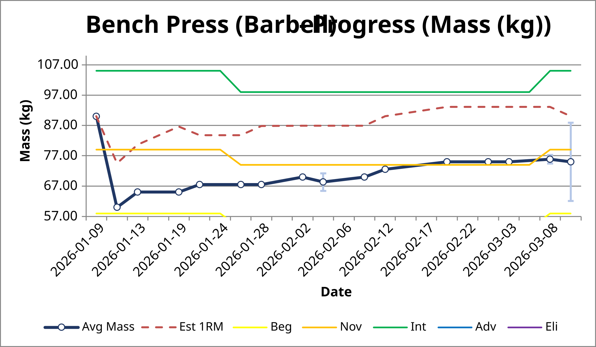
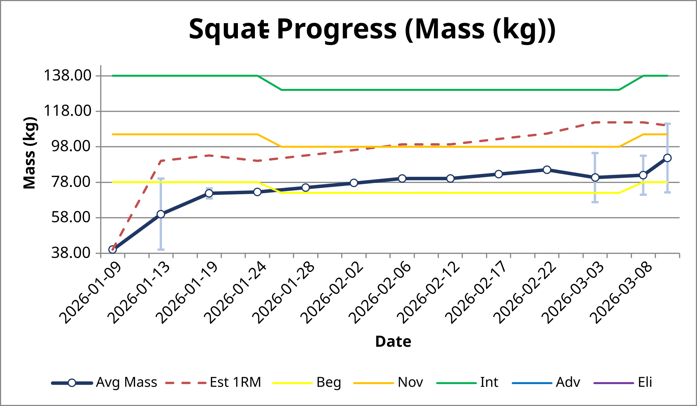
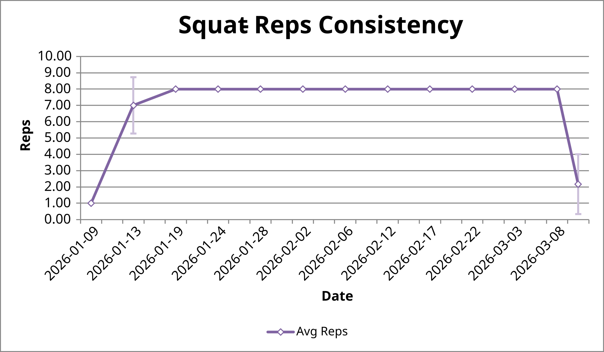
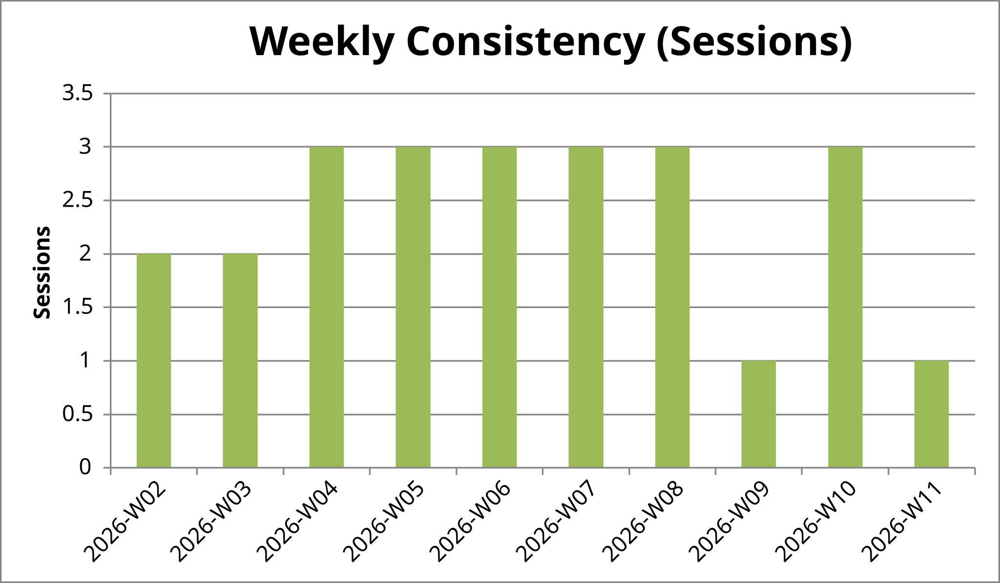
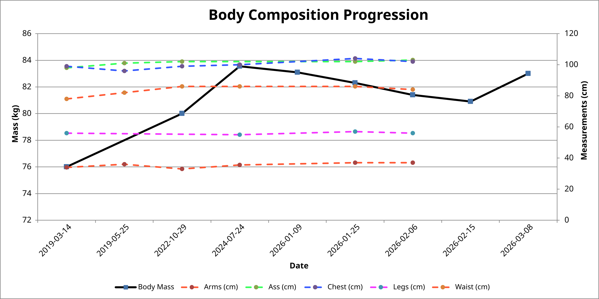

# Iron Log 🏋️‍♂️

Iron Log is a project born out of a simple need: I wanted a way to track my training that lived entirely on my machine—no subscriptions, no "smart" cloud apps that hide your data behind paywalls, just a clean Python script and my own workout logs.

It takes a simple Python dictionary where I log my sets and reps, and turns it into a high-grade Excel workbook with dynamic charts. The best part? It overlays strength standards from the community that adjust automatically as my body mass changes.

---

## Visual Tour

### Progress Tracking
I wanted to see exactly where I stand compared to benchmarks. The charts automatically scale so you're always "zoomed in" on your current performance, but you can always see the next level (like reaching for Novice or Intermediate) as a clear target line.


*Example: Tracking Bench Press PRs with shifting standard benchmarks.*


*Example: Seeing the "Next Level" target line on Squat progression.*

### Reps & Consistency
It’s not always about the heaviest weight. I track average reps to see if I'm getting more efficient, and I have a consistency chart to keep myself honest about how many days a week I'm actually showing up.


*Tracking rep efficiency over time.*


*A simple bar chart to track weekly training volume and frequency.*

### Body Composition
I track more than just weight. Since the strength standards depend on how much you weigh, I log my body mass alongside measurements like waist and biceps to see the full picture.


*Correlating body mass changes with physical measurements.*

---

## What It Actually Does

Iron Log processes your `sessions.py` file and builds a spreadsheet that includes:

*   **A Solid Data Log**: A chronological table of your workouts, including daily volume and intensity.
*   **Time-Scaled Charts**: The X-axis uses real dates. If you miss a week, you'll see that gap, which gives a much more honest view of your progress.
*   **Smart Benchmarks**: For the big lifts (Squat, Bench, Deadlift, OHP, etc.), it overlays target lines from Beginner to Elite. These lines adjust based on your body mass *on that specific day*.

## The Logic

The script uses a few standard formulas to make sense of the data:

*   **1RM Estimation**: It uses the Brzycki formula internally to estimate your maximum strength for that day. If you're doing body-mass exercises (like pull-ups), it just tracks your max reps instead.
*   **Target Padding**: I've tuned the charts to always show at least a 15kg range. This stops the chart from looking "flat" if your weights are consistent, giving you a better sense of perspective.
*   **Automatic Interpolation**: Even if you only weigh yourself once a week, the tool draws smooth lines between those points so your strength benchmarks always feel connected to your current size.

---

## How to use it

### 0. Setup
First, grab the dependencies:
```bash
pip install -r requirements.txt
```

### 1. Run it
Just fire up the main script:
```bash
python main.py
```
The first time you run it, it'll ask you where you want to save the Excel files and where your `sessions.py` is located. It remembers these in a `config.json` file. If you ever want to change them, just run `python main.py --reconfigure`.

### 2. Logging your sessions
Your data lives in `sessions.py`. You just add entries to the dictionaries there.

**Tracking your mass:**
```python
BODYMASS_LOG = {
    "2026-03-01": 80.5, # Just the mass
    "2026-03-08": {"mass": 81.0, "biceps": 38.0, "waist": 85.5}, # Full stats
}
```

**Tracking a workout:**
```python
USER_DATA = {
    "2026-03-12": { 
        SQ: Log([5, 3, 1], [80, 90, 100]), # 3 sets: 80kg x 5, 90kg x 3, 100kg x 1
        PU: Log([8, 7, 6], [0, 0, 0]),     # Use 0 mass for pull-ups
    },
}
```

### 3. Adding new exercises
If you want to add a new lift with community standards, use the parser script. You find the table on `strengthlevel.com`, copy the raw text, and paste it into the GUI:
```bash
python scripts/parse_standards.py
```
It'll clean the data and update the `core/standards.py` file automatically.
andards.py`.
